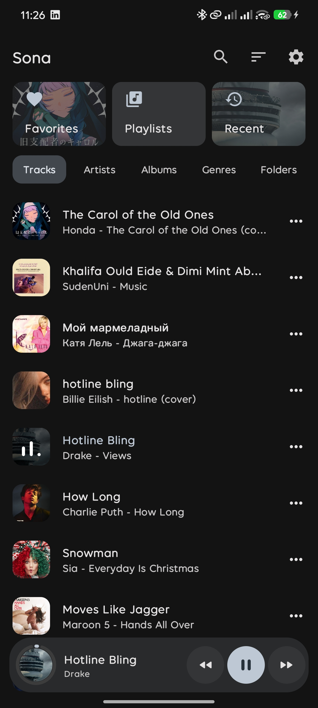
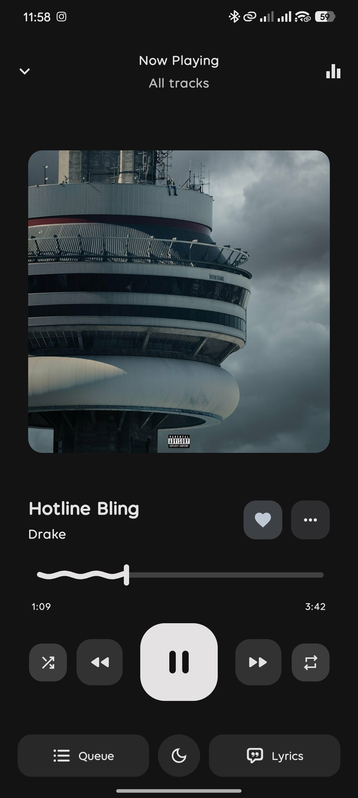
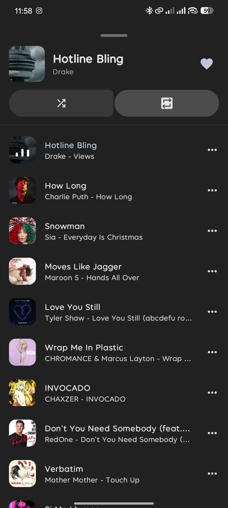
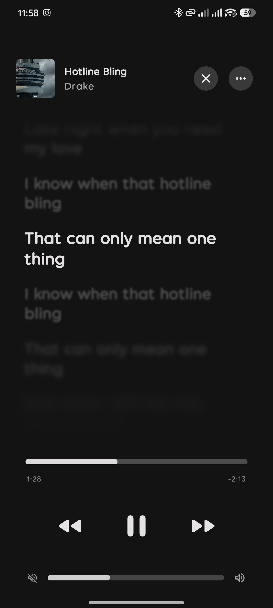
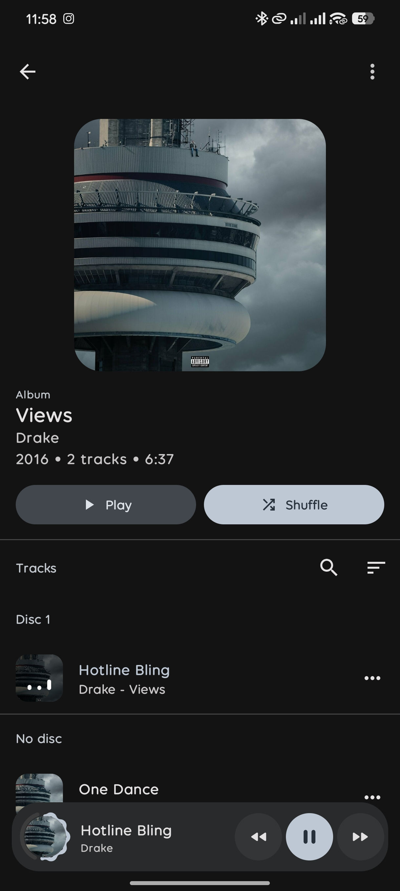
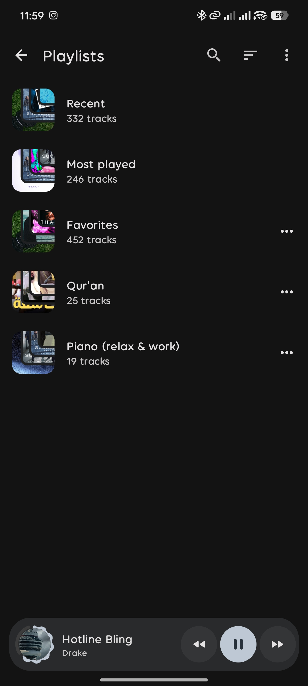
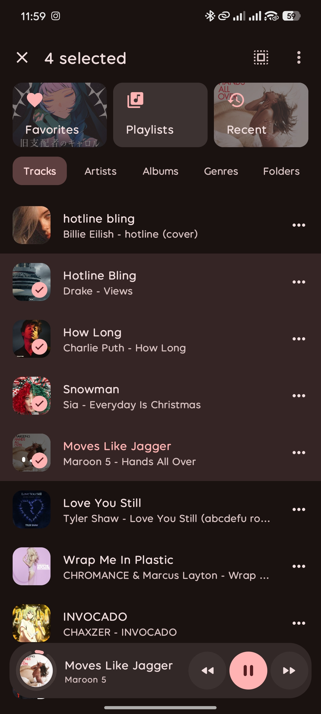
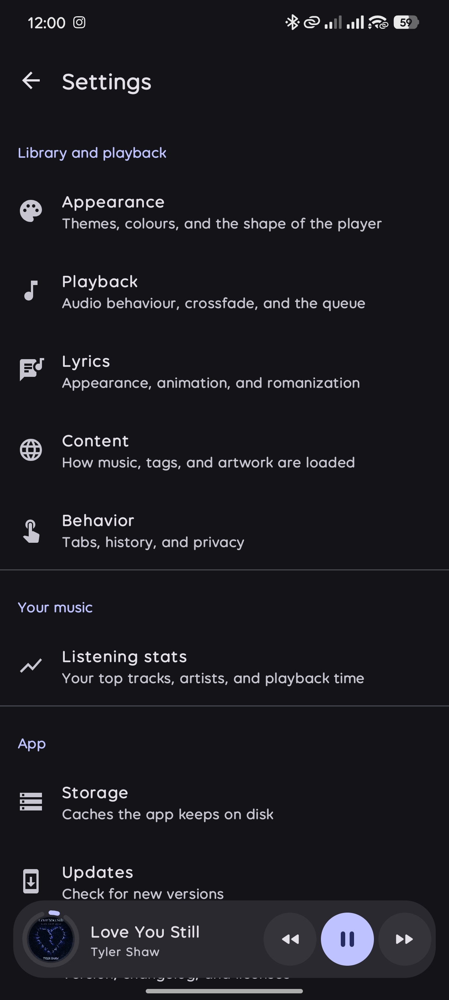

<div align="center">


# Sona

**An offline music player for Android: your files, organised, and played well.**

[](https://github.com/LhacenMed/Sona/releases/latest)
[](LICENSE)
[](#requirements)

</div>

Sona plays the music stored on your device. It has no accounts, no streaming, no ads and no analytics. It reads your library from Android's media store, keeps it in sync as files change, and gives you a fast library, playlists, synced lyrics and a full player.

## Screenshots

| Library | Player | Queue | Lyrics |
|:---:|:---:|:---:|:---:|
|  |  |  |  |

| Album | Playlists | Selection | Settings |
|:---:|:---:|:---:|:---:|
|  |  |  |  |

## Features

**Library**

- Tabs for Tracks, Artists, Albums, Genres and Folders. Each tab can be hidden.
- Search across all tabs from the top bar.
- Every list is sortable, and the sort is remembered. Albums, playlists and folders can each keep their own order.
- Intelligent sorting: ignores leading articles ("The", "A") and orders numbers naturally.
- Detail screens with a collapsing header for albums, artists, genres and folders.
- Excluded folders, for audio you never want in the library.
- The library updates by itself when files are added or removed.

**Selection and actions**

- Long-press to select rows, including across tabs, then act on all of them at once.
- An options sheet on every row: play, shuffle, play next, add to queue, add to playlist, go to artist or album, properties, share.
- Sharing sends content links to the files, so large selections are shared without copying audio.

**Playlists**

- Create, rename and delete playlists, or create one from a folder.
- Drag tracks into a custom order.
- Add single tracks, or whole albums, artists, genres, folders and playlists at once.
- Import and export M3U files.
- Favorites is a built-in playlist; Recent and Most played are built from your listening history.

**Player and playback**

- Mini player that expands into a full player; swipe the cover to change tracks.
- Reorderable queue, with the collection it is playing from shown in the header.
- Repeat all, repeat one, stop after current track, and shuffle.
- Rewind before skip-back, sleep timer, and a built-in equalizer.
- The queue and position are restored after the app is closed; a media button resumes playback without opening the app.
- Media notification with shuffle, repeat and favorite controls.
- Selectable player style and seek bar style.

**Lyrics**

- Reads lyrics embedded in audio files, including synced LRC, TTML and QRC.
- Line-by-line and word-by-word highlighting with adjustable animation.
- Romanization for Japanese, Korean, Chinese and Hindi.
- Lyrics for upcoming queue items are preloaded.

**Appearance**

- Material 3 with colours taken from the playing track's artwork, in light and dark themes.
- Composed covers for collections, in several styles.

**Updates**

- Checks this repository for new releases, downloads the APK in the background, and hands it to the system installer. Can be set to check only on request.

## Download

Download the APK from **[GitHub Releases](https://github.com/LhacenMed/Sona/releases/latest)**.

| File | Use it when |
| --- | --- |
| `sona-<version>-release-universal.apk` | You are not sure. Works on every device. |
| `sona-<version>-release-arm64-v8a.apk` | Most phones from 2017 onward. Smaller download. |
| `sona-<version>-release-armeabi-v7a.apk` | Older 32-bit ARM phones. |
| `sona-<version>-release-x86_64.apk` / `x86.apk` | Emulators and x86 devices. |

Android will ask you to allow installing from your browser or file manager the first time. After that, Sona updates itself from inside the app (Settings › Updates).

Sona is not on Google Play or F-Droid.

## Requirements

- Android 8.0 (API 26) or newer.
- Music files stored on the device.

## Permissions

| Permission | Why |
| --- | --- |
| Music and audio (`READ_MEDIA_AUDIO`; `READ_EXTERNAL_STORAGE` on Android 12 and older) | Read your music library. |
| Notifications (`POST_NOTIFICATIONS`) | Show the playback and update-download notifications. |
| Install unknown apps (`REQUEST_INSTALL_PACKAGES`) | Install downloaded updates. Android asks you to grant this the first time. |
| Internet and network state | Check for and download updates. Nothing else uses the network. |
| Foreground service, wake lock, audio settings | Keep playing in the background and apply the equalizer. |

Details in [PRIVACY.md](PRIVACY.md).

## Build from source

### Prerequisites

- **JDK 17 or newer** (the release pipeline uses JDK 21).
- **Android SDK** with platform 37 installed, or let Gradle download it.
- An Android Studio version that supports **Android Gradle Plugin 9.1** if you use an IDE.

Gradle 9.3.1 is fetched by the wrapper; you do not need to install it.

### Build

```bash
git clone https://github.com/LhacenMed/Sona.git
cd Sona
./gradlew :app:assembleDebug
```

The APK is written to `app/build/outputs/apk/debug/`. Debug builds install as **Sona Debug** (`com.lhacenmed.sona.debug`), next to a release install, and do not check for updates on their own.

On Windows, use `gradlew.bat` instead of `./gradlew`.

### Release builds and signing

`./gradlew :app:assembleRelease` produces per-ABI APKs plus a universal APK. They are signed only if a `keystore.properties` file exists in the project root:

```properties
storeFile=../sona-release-key.jks
storePassword=...
keyAlias=...
keyPassword=...
```

`storeFile` is resolved relative to the `app/` module. Both `keystore.properties` and `*.jks` are git-ignored. Without the file, release APKs are built unsigned and cannot be installed.

## Project structure

| Module | Contents |
| --- | --- |
| `:app` | Application class, main activity, app shell, launch screen |
| `:core:model` | Domain models (tracks, albums, playlists, sort orders) |
| `:core:common` | Shared utilities: dispatchers, app scope, sorting, storage paths |
| `:core:database` | Room database, entities and DAOs |
| `:core:data` | `LibraryRepository` (the app's single view of the library), lyrics loading |
| `:core:datastore` | User settings (DataStore), loaded before the first screen |
| `:core:designsystem` | Theme, dynamic colour, shared components, dialogs, menus |
| `:core:navigation` | Screen contract, navigator, host activity for pushed screens |
| `:feature:scanner` | MediaStore scanning, live change observation, file walker |
| `:feature:playback` | Media3 playback service, notification, queue, sleep timer, equalizer |
| `:feature:player` | Mini player, full player, queue, lyrics UI |
| `:feature:library` | Library tabs, detail screens, playlists, selection, options sheets |
| `:feature:settings` | Settings screens |
| `:feature:equalizer` | Equalizer screen |
| `:feature:update` | In-app update check, download service and prompt |

## Built with

Kotlin, Jetpack Compose with Material 3, Hilt, Room, DataStore, Media3 (ExoPlayer and MediaSession), Coil, MaterialKolor, AndroidX Palette, ViewPager2, Reorderable, and Kuromoji (Japanese romanization).

## Releases

Releases are built and published by GitHub Actions. Maintainers start one with:

```bash
./scripts/release.sh
```

The script asks for the release type (stable, alpha, beta, rc), the version bump and the release notes, then dispatches [`.github/workflows/release.yml`](.github/workflows/release.yml). The workflow merges `dev` into `main`, bumps the version, builds and signs the APKs, publishes the GitHub release, and updates [`version.json`](version.json), which is what the in-app updater reads. Requirements: `gh` (authenticated) and `jq`. See `./scripts/release.sh --help` for non-interactive flags.

## Contributing

Bug reports, feature requests and pull requests are welcome. Read [CONTRIBUTING.md](CONTRIBUTING.md) first. Security issues go through [SECURITY.md](SECURITY.md), not public issues.

## Credits

Sona ports code from these open-source projects. Ported files say so in their comments.

| Project | License | Used for |
| --- | --- | --- |
| [Auxio](https://github.com/OxygenCobalt/Auxio) | GPL-3.0 | Library behaviour, selection, sorting, detail screens, settings |
| [ArchiveTune](https://github.com/rukamori/ArchiveTune) | GPL-3.0 | Player, queue sheet, lyrics display, dynamic theming |
| [Fossify Music Player](https://github.com/FossifyOrg/Music-Player) | GPL-3.0 | Media scanning, playback persistence, notification |
| [cascade](https://github.com/saket/cascade) | Apache-2.0 | Cascading popup menu |

## License

Sona is free software, licensed under the **GNU General Public License v3.0**. See [LICENSE](LICENSE).

Because Sona includes GPL-3.0 code from the projects above, any distributed modified version must also be released under GPL-3.0, with its source code available.
